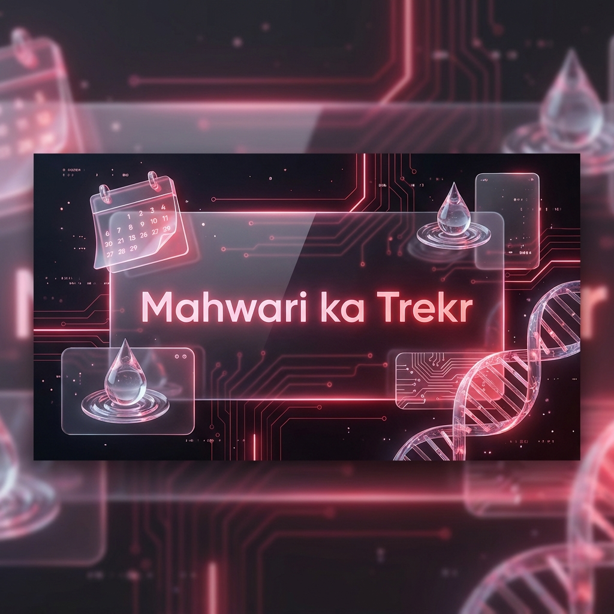

<p align="center">
  
</p>

# 🩸 Mahwari ka Trekr

> **A Secure, Personalized, and Futuristic Period Tracker tailored for you.**  
> *Seamlessly track your cycle, predict dates, and monitor your health with a high-end 3D Glassmorphism UI.* ✨

---

## 🚀 Overview

**Mahwari ka Trekr** is more than just a calendar. It's a comprehensive health companion built with **Python** and **Streamlit**, featuring robust security, intelligent analytics, and a beautiful interface.

### 🌟 Key Features

| Feature | Description | Icon |
| :--- | :--- | :---: |
| **Secure Logic** | Full **Sign Up/Login** system with **PIN protection** and **Recovery** via security questions. | 🔐 |
| **Cycle Tracker** | Log periods and view them on an **Interactive Calendar**. Highlights period (Pink) & prediction (Red). | 📅 |
| **Smart Prediction** | Automatically predicts your **Next Period** based on your unique cycle history. | 🔮 |
| **Health Hub** | **Water Tracker** with interactive progress & **Exercise Guide** via glass cards. | 🧘‍♀️ |
| **PCOD Analysis** | Logic-based **Risk Assessment** (Low/Medium/High) based on cycle regularity. | 🩺 |
| **Visuals** | Stunning **Plotly Charts** & **3D CSS Buttons** for a premium experience. | 📊 |

---

## 🛠️ Technical Stack

- **Frontend**: Streamlit (Python) 🐍
- **Visuals**: CSS3 (Glassmorphism), Plotly (Interactive Graphs) 🎨
- **Database**: SQLite (Local & Secure) 🗄️
- **Auth**: BCrypt Hashing, Session State & PIN Logic 🛡️

---

## 💻 Installation Guide

Follow these simple steps to run the app locally:

### 1. **Clone & Setup**
```bash
# Navigate to project location
cd "your/project/path"

# Create a virtual environment
python3 -m venv venv
source venv/bin/activate
```

### 2. **Install Dependencies** 📦
```bash
pip install -r requirements.txt
```

### 3. **Run the App** 🚀
```bash
streamlit run app.py
```

---

## 📸 Usage Tips

1.  **First Time?** Go to the **Sign Up** tab.
2.  **Forgot PIN?** Use the recovery flow with your security questions.
3.  **Visuals:** App looks best in **Dark Mode** (Streamlit Default).

---

<p align="center">
  <i>Built by Mano.MedEngg with ❤️ for Women's Health.</i>
</p>
