<p align="center">
  
</p>
<p align="center">
  
# 🩸 Mahwari ka Trekr

> **A Secure, Personalized, and Futuristic Period Tracker**  
> *AI-powered predictions • 3D Glassmorphism UI • Health insights in one place*

<div align="center">
  <a href="https://mahwari-ka-trekr-bprj9h7643dgot7jothnc2.streamlit.app/">
    
  </a>
  <a href="#quick-start">
    
  </a>
  <a href="#mobile-access">
    
  </a>
</div>


## ✨ **Key Features**

| Feature | Description | Status |
|---------|-------------|--------|
| 🔐 **Secure Auth** | PIN + BCrypt + Security Q&A Recovery | ✅ **Live** |
| 📅 **Cycle Calendar** | Interactive view with predictions | ✅ **Live** |
| 🔮 **Smart Predict** | AI-driven next period forecasting | 🔄 **Enhanced** |
| 🩺 **PCOD Analysis** | Risk assessment (Low/Med/High) | ✅ **Live** |
| 💧 **Health Hub** | Water tracker + Exercise guides | ✅ **Live** |
| 📊 **Premium Visuals** | Plotly charts + 3D Glassmorphism | ✨ **Premium** |

---

## 🛠️ **Tech Stack**

```yaml
Core: Python + Streamlit
UI/UX: CSS3 Glassmorphism + Plotly
Data: SQLite + BCrypt Security
Deployment: Streamlit Cloud
```

---

## 🚀 **Quick Start**

### **1. Clone & Setup**
```bash
git clone <https://github.com/ManoMedEngg/Mahwari-ka-Trekr/>
cd mhwari-ka-trekr
python -m venv
source venv/bin/activate  # Linux/Mac
venv\Scripts\activate   # Windows
```

### **2. Install Dependencies**
```bash
pip install -r requirements.txt
```

### **3. Launch App**
```bash
streamlit run app.py
```
**→ Opens at `http://localhost:8501`**

---

## 📱 **Mobile Access** 

**No APK needed!** Install as **Progressive Web App (PWA)**:

### **Android (Chrome)**
1. Open [Live App](https://mahwari-ka-trekr-bprj9h7643dgot7jothnc2.streamlit.app/)
2. Tap **⋮** (3 dots) → **"Add to Home screen"**
3. **Install** → App icon appears on home screen!

### **iOS (Safari)**
1. Open [Live App](https://mahwari-ka-trekr-bprj9h7643dgot7jothnc2.streamlit.app/)
2. Tap **Share** → **"Add to Home Screen"**
3. **Add** → Fullscreen app experience!

> **💡 Pro Tip**: Enable **Dark Mode** for best glassmorphism effects

---

## 🎨 **Modern Features**

<div align="center">

```
🔥 3D Glassmorphic Buttons
📈 Interactive Plotly Charts  
🌙 Dark Mode Optimized
⚡ Smooth Animations
🔒 End-to-End Encrypted
📱 Fully Responsive
```

</div>

---

## 🚀 **Roadmap**

```mermaid
graph TD
  A[🌟 Current: Core Features] --> B[🔜 Voice Logging]
  B --> C[⌛ Wearable Integration]
  C --> D[⌛ Multi-Language]
  D --> E[🎯 ML Predictions]
```



---

## 🤝 **Contribute**

1. Fork the repo
2. Create feature branch (`git checkout -b feature/amazing-feature`)
3. Commit changes (`git commit -m 'Add amazing feature'`)
4. Push & Open PR!

<div align="center">

```
⭐ Star if you like it!
💬 Join the conversation
🐛 Report bugs here
```

</div>

---

<div align="center">
  
[](https://streamlit.io)
[](https://python.org)
[](https://github.com/yourusername/mahwari-ka-trekr)

**Built with ❤️ for Women's Health**  
*By [Mano.MedEngg](https://github.com/yourusername)* 👩‍⚕️✨

</div>
